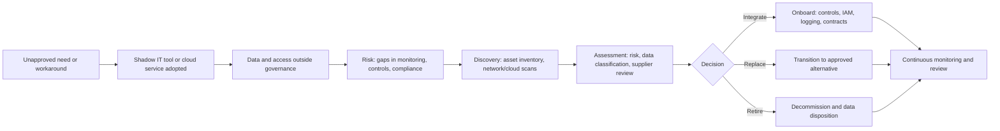

# Shadow IT: The Silent Threat Inside Your ISMS

> **Last verified:** 2026-07-03. The ISO/IEC 27001:2022 Annex A control mappings,
> the GDPR Chapter V reference, and the CASB and SSE definitions were checked
> against authoritative sources.

Every organization has it: systems and tools employees use without formal approval. It might be a cloud storage app, a collaboration platform, or a SaaS product someone signed up for just to get the job done. Sometimes it is a developer or IT specialist spinning up a new service or virtual machine in a cloud provider without following the proper approval or configuration process. In other cases, it might be a team adopting an external vendor or SaaS platform that has not gone through the organization's security or supplier assessment process.

Shadow IT often starts with good intentions but can quietly undermine even the most mature Information Security Management System (ISMS).

## Why it is a problem

Unapproved tools create blind spots in risk management. If a system is not known, it cannot be assessed, and vulnerabilities or compliance gaps can go unnoticed. Sensitive data may also find its way into unmanaged environments, breaking data classification controls and creating compliance risks under a standard like ISO/IEC 27001 or a regulation like the GDPR.

Shadow IT fragments security controls. Tools used outside approved environments often lack proper access management, encryption, and logging, which limits visibility for monitoring and incident response. Over time, it becomes harder to maintain an accurate asset inventory or keep the ISMS scope current.

The risks go beyond the obvious ones, and several are easy to overlook:

- **Data residency and cross-border transfer.** Unsanctioned SaaS may store data in jurisdictions that breach GDPR Chapter V transfer rules, a distinct exposure from general "compliance risk."
- **OAuth and third-party app grants.** A user who grants OAuth scopes to an external app (or installs a browser extension with broad permissions) creates persistent, token-based access to corporate data that a password reset does not always revoke and that is invisible to network monitoring.
- **Orphaned access at offboarding.** IT cannot deprovision accounts it does not know exist, so leavers can retain access to shadow systems long after their last day.
- **License, cost, and contractual exposure.** Duplicate or unmanaged subscriptions create budget waste and true-up risk, and may commit the organization to terms no one reviewed.

## How it maps to ISO/IEC 27001:2022

Managing Shadow IT is not a single control; it draws on several Annex A controls, which is useful when you need to justify the work or evidence it to an auditor:

| Activity | ISO/IEC 27001:2022 Annex A control |
| --- | --- |
| Keep a complete asset inventory | A.5.9 Inventory of information and other associated assets |
| Classify and protect data correctly | A.5.12 Classification of information |
| Assess and contract external providers | A.5.19-A.5.22 Supplier relationships |
| Govern adoption of cloud services | A.5.23 Information security for use of cloud services |
| Restrict who can deploy or configure | A.5.15 Access control; A.5.18 Access rights; A.8.2 Privileged access rights; A.8.3 Information access restriction |
| Detect unmanaged systems and activity | A.8.16 Monitoring activities |

> Control titles and numbers reflect ISO/IEC 27001:2022 Annex A. Verify against the published standard before citing in formal documentation.

## How to manage it within an ISMS

Start with visibility: identify all systems in use and include them in your risk assessments. Establish clear governance and ownership to ensure accountability for every system. Apply the principle of least privilege to limit who can deploy or configure new services, especially in cloud environments. Set practical policies for how new tools can be introduced and approved, supported by awareness and training so employees understand both the process and its purpose.

For discovery, network monitoring alone is no longer enough. It cannot see inside encrypted SaaS sessions or catch cloud-to-cloud OAuth grants, and it misses any SaaS reached from off the corporate network. Combine it with **Cloud Access Security Broker (CASB) / Security Service Edge (SSE)** platforms, SaaS-management tooling, and your identity provider's OAuth app inventory to see what is actually in use.

Treat Shadow IT as an ongoing risk within your ISMS: track it in your risk register, review it during management meetings, and include it in your continuous improvement cycle.

Make the sanctioned path the easy path. Shadow IT usually appears because the approved path is too slow, so a fast, low-friction request process is often the most effective control: it removes the incentive to go around governance in the first place. When you combine that with discovery and assessment, Shadow IT shifts from a hidden problem to a known and managed risk, aligned with the continuous improvement goals of a mature ISMS.

---

## Quick checklist

- Asset inventory includes sanctioned and currently discovered unsanctioned tools
- Ownership defined for every system and service
- Least privilege enforced for cloud subscriptions and deployment roles
- Standard, fast request and approval path for new tools and vendors
- Supplier security assessments performed for all external services
- License, cost, and contract terms reviewed for external subscriptions
- Continuous discovery in place: network, endpoint, cloud, and OAuth/SaaS app inventory
- Data residency and cross-border transfer checked for each external service
- Offboarding process covers shadow accounts and revokes OAuth/app grants
- Shadow IT tracked as a standing risk with defined treatment actions

---

## Typical examples

- Team uses a free SaaS tool for file sharing with client data
- Developer spins up a VM or managed database in a personal or team cloud account
- Department adopts a project management platform without supplier review
- Browser extension or third-party app granted broad OAuth permissions without assessment

---

## Simple lifecycle diagram

